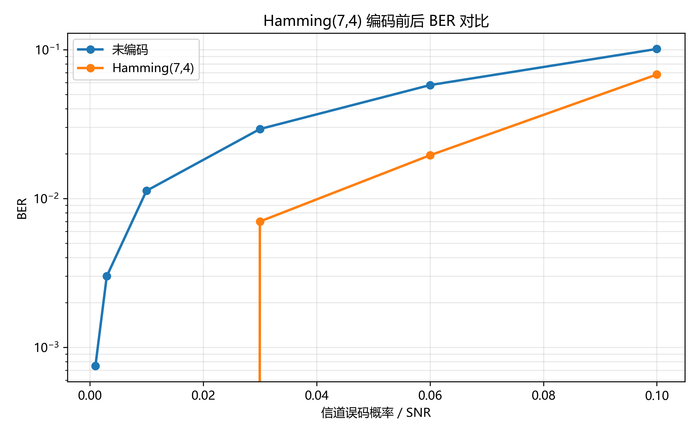
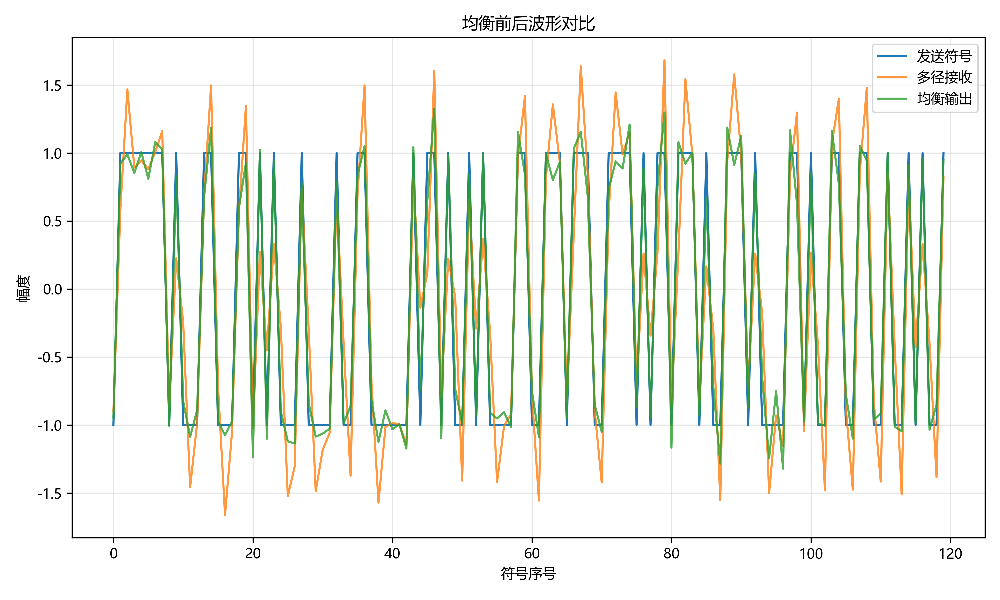
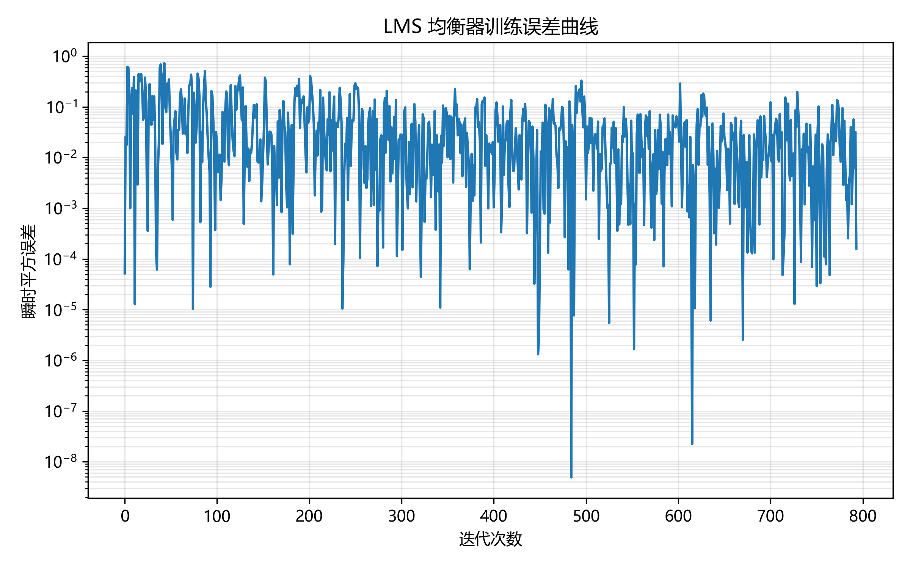

# 无线通信技术实验报告：信道编码与信道均衡

## 1. 实验目的

本实验通过补全 Python 仿真程序，理解无线通信中误码、噪声、多径传播和符号间干扰对系统可靠性的影响。实验重点包括 Hamming(7,4) 线性分组码的编码、伴随式检测和单比特纠错，以及 ZF 迫零均衡器和 LMS 自适应均衡器对多径 ISI 的抑制效果。完成实验后，可以用自动测试和评分脚本验证代码正确性，并用结果图分析编码和均衡前后的性能变化。

## 2. 实验原理

### 2.1 信道编码

Hamming(7,4) 码每 4 个信息比特生成 7 个码字比特，在原始信息后加入 3 个校验比特。本实验采用系统码形式，码字前 4 位仍为信息位，编码关系为：

```text
c = uG mod 2
```

其中 `u` 为 4 比特信息块，`G` 为生成矩阵，所有运算在 GF(2) 上进行。

接收端用校验矩阵 `H` 计算伴随式：

```text
s = rH^T mod 2
```

如果 `s` 为全零，则认为没有检测到单比特错误；如果 `s` 非零，则将伴随式与 `H` 的每一列比较。Hamming(7,4) 的校验矩阵列向量与码字位置一一对应，因此单个比特翻转会产生唯一伴随式，接收端可以定位错误位置并翻转该比特。由于码字前 4 位是信息位，纠错后取前 4 位即可得到译码结果。信道编码通过加入冗余提高可靠性，但码率从 1 降为 4/7。

选做部分实现了约束长度为 3 的 (2,1,3) 卷积码，生成多项式为 `g1=111`、`g2=101`。编码器每输入 1 个比特输出 2 个比特，并在末尾补 2 个零使状态回到全零。Viterbi 硬判决译码使用汉明距离作为路径度量，动态保留每个状态的最优路径，最后从终止状态回溯得到信息比特。

### 2.2 信道均衡

多径信道可视为 FIR 系统，接收符号是当前符号和若干历史符号的叠加，因此会产生 ISI。若发送序列为 `x[n]`，信道冲激响应为 `h[k]`，接收信号近似为：

```text
r[n] = sum h[k] x[n-k] + noise[n]
```

ZF 均衡器的目标是设计 FIR 抽头 `w`，使 `h` 与 `w` 的卷积尽量接近单位冲激。实验中构造卷积矩阵 `A`，令 `A @ w` 表示信道和均衡器的整体响应，再通过最小二乘求解目标冲激响应。ZF 能抑制 ISI，但在信道频谱存在深衰落时可能放大噪声。

LMS 均衡器是自适应算法。它根据训练序列不断更新抽头，误差定义为期望发送符号与均衡输出之差：

```text
y[n] = w^T x[n]
e[n] = d[n] - y[n]
w = w + mu e[n] x[n]
```

步长 `mu` 决定收敛速度和稳定性。步长太大容易发散，太小则收敛慢。本实验用接收训练序列和已知发送符号训练均衡器，再将训练后的抽头应用到完整接收序列。

## 3. 实验环境

- Python 版本：3.13.2
- 主要依赖：NumPy、Matplotlib、pytest、pylint
- 操作系统：Windows
- AI 助手使用情况：使用 AI 辅助阅读实验要求、补全 TODO 函数、分析测试结果和生成报告说明；核心函数均通过本地 pytest 和实验脚本验证。

## 4. 实验方法

### 4.1 Part 1：信道编码

首先将输入比特按 4 位一组 reshape，使用 `HAMMING_G` 进行矩阵乘法并对 2 取模，得到 Hamming(7,4) 码字。译码时先将接收序列按 7 位一组 reshape，计算每个码字的伴随式。若伴随式非零，就在 `HAMMING_H` 的列中查找匹配项，找到后翻转对应位置，最后输出每个码字的前 4 位。

BER 仿真中，对未编码比特和编码比特分别通过二元对称信道，在多个误码概率下计算误比特率，并绘制编码前后的 BER 曲线。

### 4.2 Part 2：信道均衡

ZF 部分根据给定信道 `channel=[0.9, 0.35, -0.25]` 构造卷积矩阵，求解长度为 7 的均衡器抽头，使整体响应接近中心冲激。FIR 滤波函数使用完整卷积并截取与输入等长的前段输出。

LMS 部分用前 800 个接收符号和发送符号作为训练序列。抽头初值设置为第一个抽头为 1，之后逐点构造当前和历史接收样本向量，计算输出、误差并按 LMS 公式更新抽头。训练完成后将抽头作用于完整接收信号，比较均衡前后 BER，并绘制波形对比和误差曲线。

## 5. 实验结果



图中比较了未编码传输和 Hamming(7,4) 编码传输在不同信道误码概率下的 BER。Hamming 码可以纠正单比特错误，因此在低到中等误码概率下能降低译码后的 BER。



图中给出了发送符号、多径接收信号和 LMS 均衡输出的波形对比。多径接收信号出现相邻符号叠加，均衡后波形更接近原发送 BPSK 符号。



图中显示 LMS 训练过程中的瞬时平方误差。随着抽头逐步适应信道，误差整体呈下降趋势，说明均衡器在训练序列上收敛。

本地运行结果显示：Part 1 和 Part 2 的 pytest 均为 8/8 通过；Part 2 演示中均衡前 BER 为 0.0010，LMS 均衡后 BER 为 0.0000。

## 6. 结果分析

Hamming(7,4) 能纠正单比特错误，是因为 7 个码字位置对应 7 个不同的非零伴随式。单个比特出错后，伴随式正好等于校验矩阵对应列，因此可以唯一定位错误位置。但当一个码字中出现两个或更多错误时，伴随式不再对应真实的单一错误位置，可能出现误纠。

信道编码会引入冗余。Hamming(7,4) 每 4 位信息发送 7 位码字，牺牲码率换取纠错能力。在误码概率较低时，单比特错误占主要比例，编码收益明显；当误码概率较高时，多比特错误增多，Hamming 码的纠错能力受限。

ZF 均衡通过逼近信道逆响应来消除 ISI。如果信道某些频率分量很弱，逆滤波会需要很大的增益，这会同时放大噪声，因此 ZF 并不总是最优。LMS 不直接求信道逆，而是根据训练序列逐步调整抽头，具有实现简单、可跟踪信道变化的优点。步长过大会导致抽头震荡或发散，步长过小会使训练时间变长。

从均衡结果看，多径信道使接收波形产生拖尾和符号间叠加；LMS 均衡后，输出符号幅度更集中，误差曲线下降，说明 ISI 得到了抑制。

## 7. 实验心得

本实验把课件中的矩阵编码、伴随式译码和自适应均衡公式落实到代码中。Hamming 编码部分的关键是严格保持 GF(2) 运算，并理解校验矩阵列向量如何定位错误；均衡部分的关键是处理好卷积矩阵、FIR 截取和 LMS 训练序列的时序对齐。通过自动测试可以快速发现函数签名、返回形状和误差收敛问题，比只看仿真图更可靠。

## 8. 参考资料

- 课程课件：第 6 章 信道编码
- 课程课件：第 7 章 均衡
- 实验指导手册：信道编码与信道均衡综合实验
- NumPy 官方文档：矩阵运算、卷积和最小二乘求解
